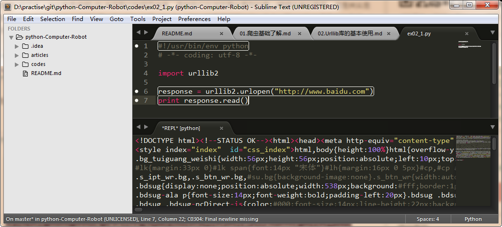

# 02 Urllib库的基本使用

##01 分分钟扒一个网页下来
怎样扒网页呢？其实就是根据URL来获取它的网页信息，虽然我们在浏览器中看到的是一幅幅优美的画面，但是其实是由浏览器解释才呈现出来的，实质它是一段HTML代码，加 JS、CSS，如果把网页比作一个人，那么HTML便是他的骨架，JS便是他的肌肉，CSS便是它的衣服。所以最重要的部分是存在于HTML中的，下面我们就写个例子来扒一个网页下来。
```
import urllib2
 
response = urllib2.urlopen("http://www.baidu.com")
print response.read()
```
是的你没看错，真正的程序就两行，把它保存成 `demo.py`，进入该文件的目录，执行如下命令查看运行结果，感受一下。



##02 分析爬网页的方法
```
#引入包
import urllib2

#调用方法
response = urllib2.urlopen("http://www.baidu.com")

#输出
print response.read()
```

##03 构造Request
其实上面的urlopen参数可以传入一个request请求,它其实就是一个Request类的实例，构造时需要传入Url,Data等等的内容。比如上面的两行代码，我们可以这么改写
```
import urllib2
 
request = urllib2.Request("http://www.baidu.com")
response = urllib2.urlopen(request)
print response.read()
```
运行结果是完全一样的，只不过中间多了一个request对象，推荐大家这么写，因为在构建请求时还需要加入好多内容，通过构建一个request，服务器响应请求得到应答，这样显得逻辑上清晰明确。

##04 POST和GET数据传递
上面的程序演示了最基本的网页抓取，不过，现在大多数网站都是动态网页，需要你动态地传递参数给它，它做出对应的响应。所以，在访问时，我们需要传递数据给它。最常见的情况是什么？对了，就是登录注册的时候呀。

把数据用户名和密码传送到一个URL，然后你得到服务器处理之后的响应，这个该怎么办？下面让我来为小伙伴们揭晓吧！

数据传送分为POST和GET两种方式，两种方式有什么区别呢？

最重要的区别是GET方式是直接以链接形式访问，链接中包含了所有的参数，当然如果包含了密码的话是一种不安全的选择，不过你可以直观地看到自己提交了什么内容。POST则不会在网址上显示所有的参数，不过如果你想直接查看提交了什么就不太方便了，大家可以酌情选择。

+ POST方式：
上面我们说了data参数是干嘛的？对了，它就是用在这里的，我们传送的数据就是这个参数data，下面演示一下POST方式。
```
import urllib
import urllib2

values = {"username":"1016903103@qq.com","password":"XXXX"}
data = urllib.urlencode(values) 
url = "https://passport.csdn.net/account/login?from=http://my.csdn.net/my/mycsdn"
request = urllib2.Request(url,data)
response = urllib2.urlopen(request)
print response.read()
```

注意上面字典的定义方式还有一种，下面的写法是等价的
```
import urllib
import urllib2
 
values = {}
values['username'] = "1016903103@qq.com"
values['password'] = "XXXX"
data = urllib.urlencode(values) 
url = "http://passport.csdn.net/account/login?from=http://my.csdn.net/my/mycsdn"
request = urllib2.Request(url,data)
response = urllib2.urlopen(request)
print response.read()
```

以上方法便实现了POST方式的传送

+ GET方式：
至于GET方式我们可以直接把参数写到网址上面，直接构建一个带参数的URL出来即可。
```
import urllib
import urllib2
 
values={}
values['username'] = "1016903103@qq.com"
values['password']="XXXX"
data = urllib.urlencode(values) 
url = "http://passport.csdn.net/account/login"
geturl = url + "?"+data
request = urllib2.Request(geturl)
response = urllib2.urlopen(request)
print response.read()
```